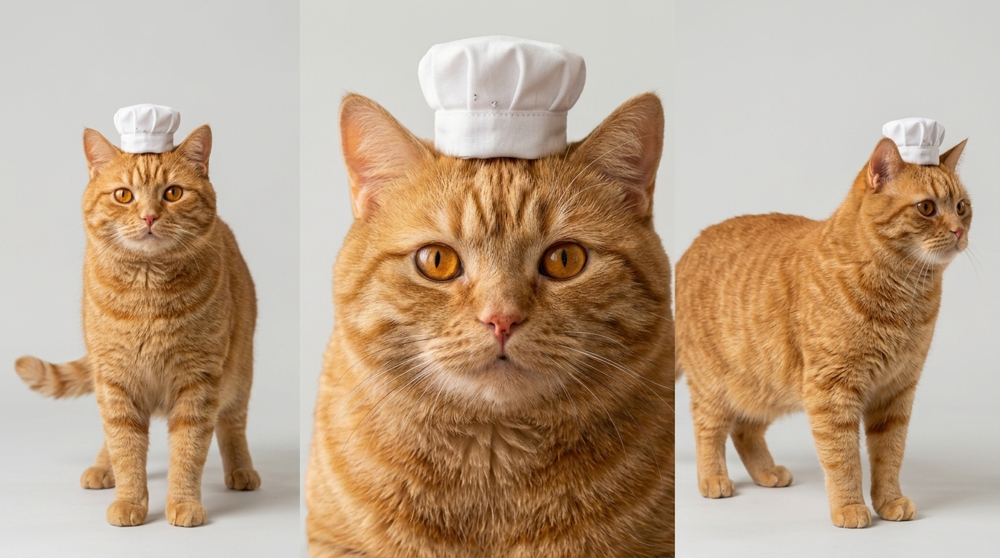
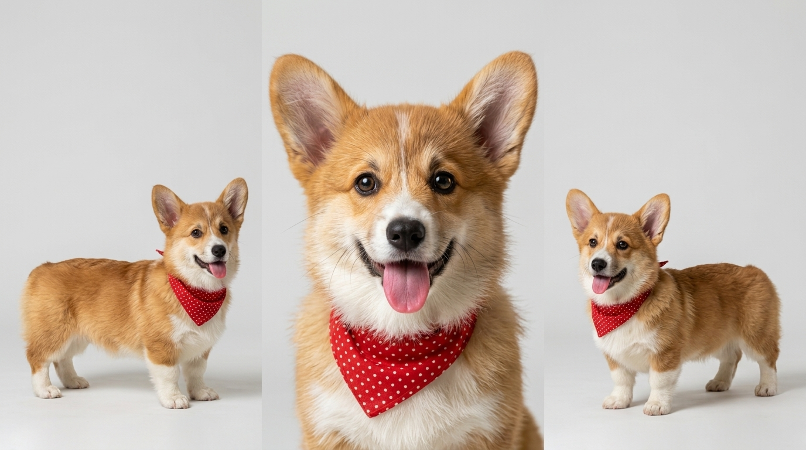
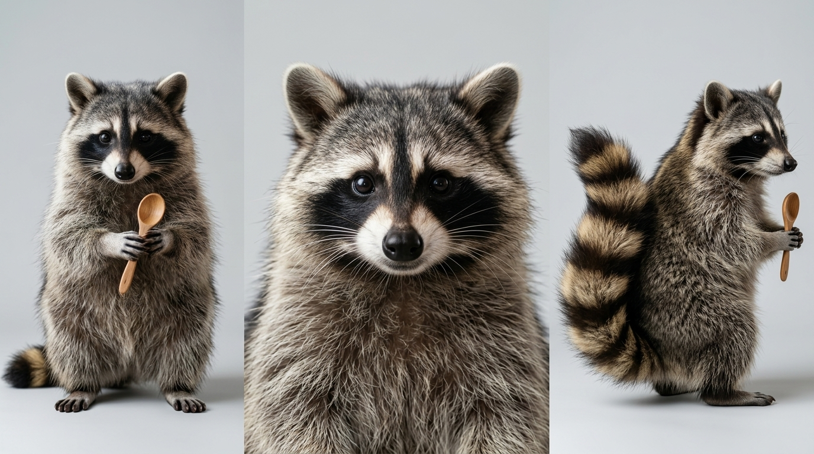
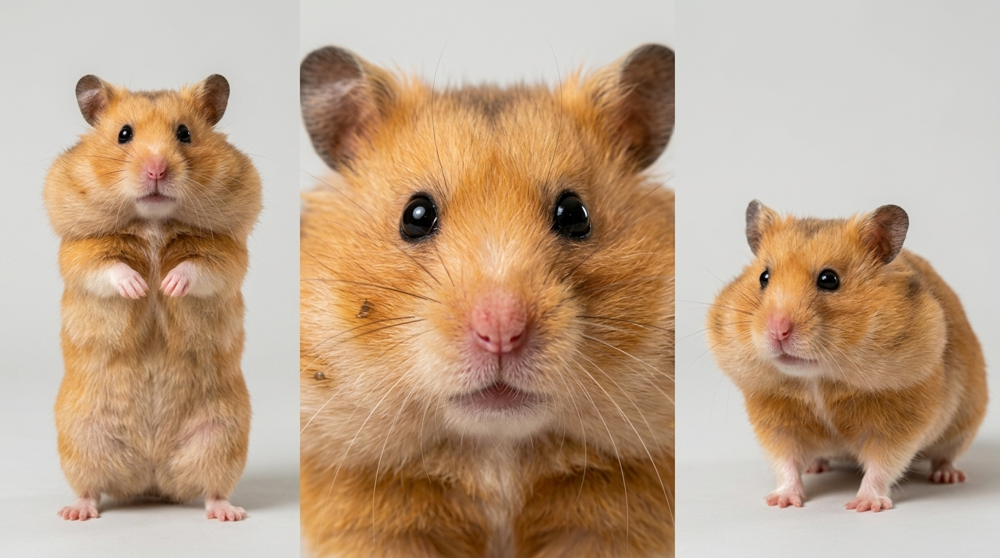
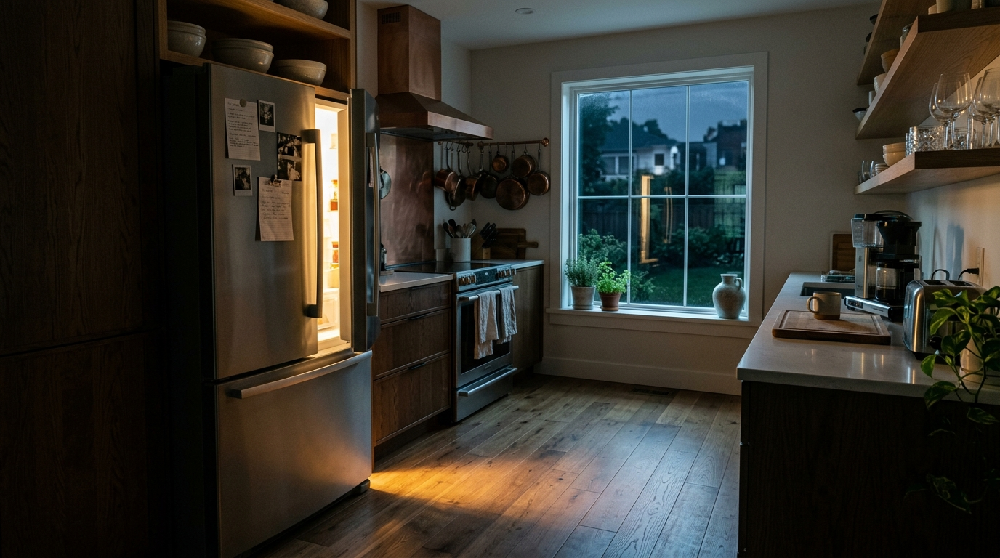

# 🎬 LTX-2.5 Video Studio & Multi-Subject Reference (MSR)

[](https://www.python.org/)
[](https://github.com/comfyanonymous/ComfyUI)
[](https://gradio.app/)
[](LICENSE)
[](https://huggingface.co/Lightricks/LTX-2.5)

Hệ thống tạo video AI chuyên nghiệp dựa trên mô hình **Lightricks LTX-2.5 (22B)** tích hợp trực tiếp với **ComfyUI Backend** và giao diện **Gradio WebUI (tương thích Gradio 6.0+)**. Hỗ trợ tạo video độ phân giải cao (HD 720p+), kiểm soát tính nhất quán nhân vật qua **IC-LoRA Ingredients**, tạo video dài tự động qua **Multi-Subject Reference (MSR)** và kịch bản nhiều phân cảnh nối liền bằng FFmpeg.

---

## 🌟 Demo & Video Test Showcase: "Đại Náo Tủ Lạnh Lúc Nửa Đêm"

Dự án đi kèm bộ tài nguyên test thực tế hoàn chỉnh trong thư mục [`msr_midnight_snack_heist/`](msr_midnight_snack_heist/):

### 🎭 Ảnh tham khảo nhân vật & Bối cảnh (MSR Inputs)

| 🐱 Pic 1 (Bắt buộc): Mèo Đầu Bếp | 🐶 Pic 2: Chó Corgi Lùn | 🦝 Pic 3: Gấu Mèo Raccoon | 🐹 Pic 4: Chuột Hamster | 🌄 Background: Nhà Bếp Ban Đêm |
| :---: | :---: | :---: | :---: | :---: |
|  |  |  |  |  |

### 🎬 Video Test Kết Quả (Generated Long Video Output)
- 🎞️ **Video Hoàn Chỉnh (3 phân cảnh 30s):** [`msr_midnight_snack_heist/output/final_long_msr_video_1787555144.mp4`](msr_midnight_snack_heist/output/final_long_msr_video_1787555144.mp4)
- 🎞️ **Phân đoạn mẫu Stage 1 (Preview):** [`msr_midnight_snack_heist/output/LTX25_MSR_Stage1_00001_.mp4`](msr_midnight_snack_heist/output/LTX25_MSR_Stage1_00001_.mp4)
- 📝 **Chi tiết kịch bản mẫu:** Xem [`msr_midnight_snack_heist/kich_ban_msr_animal_comedy.md`](msr_midnight_snack_heist/kich_ban_msr_animal_comedy.md)

---

## 🚀 Điểm nổi bật & Tính năng chính

### 1. ⚡ Tự động hóa cài đặt & Tải Model siêu tốc (`download.py` / `ltx_2_5_msr_upgrade.py` Cell 1)
- Cài đặt môi trường cực nhanh qua `uv pip` (nhanh gấp 5-10x so với `pip` thông thường).
- Tải song song đa luồng các checkpoint nặng (~40GB) bằng `aria2c` với cơ chế resume tự động.
- Tự động nạp:
  - **Transformer:** `ltx-2.5-22b-distilled-transformer-comfy-int8-convrot.safetensors`
  - **Text Encoder:** `gemma4-12b-with-proj-ltx-2.5-comfy-int8-convrot.safetensors`
  - **Prompt Enhancer (VLM):** `gemma4_e2b_it_bf16.safetensors`
  - **VAE:** Video VAE & Audio VAE BF16
  - **Upscaler:** `ltx-2.5-latent-spatial-upscaler-x2-bf16-1.0.safetensors`
  - **LoRA:** IC-LoRA Ingredients (giữ nhân vật/props) & Licon MSR V1 LoRA.
- Ghi nhận và hiển thị version/commit hash của các custom node bên thứ ba qua `_node_versions.json`.

### 2. 🧬 LTX-2.5 MSR Studio - Multi-Subject Reference (`ltx_2_5_msr_upgrade.py` & `ltx2_5_msr.py`)
- **Đa nhân vật (Tối đa 4 nhân vật + 1 bối cảnh):** Slot `Pic 1` đến `Pic 4` cùng `Background`.
- **Cơ chế PromptRelay:** Tự động map mô tả từng nhân vật (`Image 1: ...`, `Image 2: ...`) với ảnh tham khảo tương ứng qua attention layer.
- **✨ Prompt Enhancer thông minh:** Tích hợp model Gemma nhẹ (`gemma4_e2b_it_bf16`) tự động mở rộng câu prompt ngắn thành mô tả điện ảnh giàu chi tiết.
- **Tự động hóa kịch bản & Ghép phim:** Nhập kịch bản gồm nhiều phân cảnh (cách nhau 1 dòng trống); hệ thống tự render tuần tự từng cảnh 10s và tự động nối bằng `FFmpeg` thành video hoàn chỉnh dài 30s, 60s+.
- **Bắt lỗi ComfyUI chuẩn xác:** Đọc trực tiếp status/error traceback từ `/history/{prompt_id}` để thông báo rõ ràng node nào bị lỗi.

### 3. 🎨 LTX-2.5 AI Video Studio Đa Năng (`ltx2_5.py`)
Tích hợp 3 luồng xử lý (Pipelines):
- **🖼️ PIPE 1: Ảnh → Video (I2V) & Text → Video (T2V):** Tạo video chuyển động tự nhiên từ ảnh tĩnh hoặc tạo từ prompt văn bản.
- **🎞️ PIPE 2: Nối 2 Khung Đầu/Cuối (FLF2V) & Âm thanh:** Tạo chuyển động mượt mà giữa khung hình bắt đầu và kết thúc (First-Last-Frame interpolation), tự động tạo âm thanh đồng bộ.
- **🎯 PIPE 3: Storyboard (Phân cảnh liên hoàn):** Tạo chuỗi phân cảnh kịch bản liên tiếp với cơ chế giữ nhất quán bối cảnh/nhân vật qua từng cảnh.

### 4. 💎 Quy trình tạo hình 2-Stage Denoising
- **Stage 1 (Half Res):** Khởi tạo chuyển động và bố cục nhanh chóng ở độ phân giải $1/2$.
- **Spatial Latent Upscale:** Nâng cấp x2 latent resolution bằng latent spatial upscaler.
- **Stage 2 (Refinement):** Khử nhiễu chi tiết và hoàn thiện video ở chuẩn HD sắc nét.

---

## 💻 Yêu cầu phần cứng (Hardware Requirements)

| Thành phần | Yêu cầu tối thiểu | Khuyến nghị (Tối ưu) |
| :--- | :--- | :--- |
| **GPU** | NVIDIA GPU 16GB VRAM (T4*) | **24GB+ VRAM** (L4, A100, RTX 3090, RTX 4090) |
| **Hệ thống** | Google Colab Pro / Linux / Windows WSL2 | Google Colab (L4/A100) / Dedicated AI Server |
| **Dung lượng đĩa** | ~60GB trống (Model weights + ComfyUI) | ~100GB SSD NVMe |
| **RAM** | 16GB System RAM | 32GB+ System RAM |

> [!WARNING]
> *Mô hình LTX-2.5 22B + Gemma 4 Text Encoder chiếm tổng cộng ~37GB trọng số. Trên GPU 16GB (như Colab T4), hệ thống sẽ bật Low VRAM mode (offload sang RAM), thời gian render sẽ lâu hơn. Khuyến khích sử dụng **GPU 24GB VRAM trở lên (L4 hoặc A100)**.*

---

## 🚀 Hướng dẫn sử dụng trên Google Colab

### Bước 1: Chuẩn bị Hugging Face Token (Bắt buộc)
Mô hình **LTX-2.5** và **IC-LoRA Ingredients** được bảo vệ (gated repository). Bạn cần:
1. Đăng ký tài khoản tại [HuggingFace](https://huggingface.co/).
2. Truy cập [Hugging Face Token Settings](https://huggingface.co/settings/tokens) và tạo một **Access Token** (loại `Read`).
3. Truy cập và nhấn **"Agree and access repository"** tại cả 2 repo:
   - [Lightricks/LTX-2.5](https://huggingface.co/Lightricks/LTX-2.5)
   - [Lightricks/LTX-2.3-22b-IC-LoRA-Ingredients](https://huggingface.co/Lightricks/LTX-2.3-22b-IC-LoRA-Ingredients)
4. (Tùy chọn) Thêm token vào **Colab Secrets** với tên `HF_TOKEN` (biểu tượng chiếc chìa khóa 🔑 ở thanh bên trái Colab).

### Bước 2: Chạy trên Google Colab

#### Cách 1: Sử dụng Bản Nâng Cấp Tự Động Toàn Diện (`ltx_2_5_msr_upgrade.py`) — Khuyến nghị ⭐
Mở Colab, dán code từ `ltx_2_5_msr_upgrade.py` và chạy:
- **Cell 1:** Cài đặt ComfyUI, custom nodes, tải model ~40GB và ghi nhận commit node.
- **Cell 2 (Cell MSR):** Khởi chạy giao diện MSR Studio Gradio với Prompt Enhancer, sửa lỗi validation, tự động bắt lỗi và nối video.

#### Cách 2: Chạy Từng Module Độc Lập
1. **Cài đặt & Tải Model:**
   ```python
   !python download.py
   ```
2. **Khởi chạy Multi-Subject Reference Studio:**
   ```python
   !python ltx2_5_msr.py
   ```
3. **Hoặc Khởi chạy Studio Tổng Hợp (T2V / I2V / FLF2V):**
   ```python
   !python ltx2_5.py
   ```

---

## 📁 Cấu trúc thư mục (Repository Structure)

```text
├── download.py                              # Script tải dependencies & model weights
├── ltx_2_5_msr_upgrade.py                   # Script All-in-One (Cell 1 + Cell MSR nâng cấp)
├── ltx2_5_msr.py                            # MSR Multi-Subject Reference Studio (Gradio UI)
├── ltx2_5.py                                # Studio Đa Năng (I2V / T2V / FLF2V / Storyboard)
├── LTX2.5-MSR-sample-workflow.json          # Workflow mẫu kéo thả vào ComfyUI
├── msr_midnight_snack_heist/                # Bộ dữ liệu demo & kịch bản mẫu 9:16
│   ├── kich_ban_msr_animal_comedy.md        # Kịch bản chi tiết & lời thoại phân cảnh
│   ├── msr_pic1_chef_cat_ref.jpg            # Ảnh mẫu Pic 1: Mèo đầu bếp
│   ├── msr_pic2_corgi_puppy_ref.jpg         # Ảnh mẫu Pic 2: Chó Corgi lùn
│   ├── msr_pic3_raccoon_bandit_ref.jpg      # Ảnh mẫu Pic 3: Gấu mèo Raccoon
│   ├── msr_pic4_hamster_agent_ref.jpg       # Ảnh mẫu Pic 4: Chuột Hamster
│   ├── msr_bg_midnight_kitchen.jpg          # Ảnh mẫu Background: Bếp ban đêm
│   └── output/                              # Thư mục video test đã render hoàn chỉnh
│       ├── LTX25_MSR_Stage1_00001_.mp4      # Phân đoạn mẫu Stage 1
│       └── final_long_msr_video_1787555144.mp4 # Phim hoàn chỉnh ghép nối 30s
├── README.md                                # Tài liệu hướng dẫn
└── LICENSE                                  # Giấy phép mã nguồn mở MIT
```

---

## ❓ Xử lý sự cố thường gặp (FAQ & Troubleshooting)

### 1. Lỗi HTTP 401 / 403 khi tải model
- **Nguyên nhân:** Chưa nhập đúng `HF_TOKEN` hoặc chưa bấm đồng ý thỏa thuận bản quyền tại repo Hugging Face của Lightricks.
- **Khắc phục:** Truy cập cả 2 đường link ở [Bước 1](#bước-1-chuẩn-bị-hugging-face-token-bắt-buộc), bấm **Agree and access repository**, sau đó chạy lại `download.py`.

### 2. Lỗi `TextGenerateLTX2Prompt.execute() missing argument 'sampling_mode'`
- **Khắc phục:** Đã được sửa hoàn chỉnh trong bản cập nhật `ltx_2_5_msr_upgrade.py`. Các tham số dynamic combo được truyền chuẩn định dạng `sampling_mode.*`.

### 3. Báo lỗi Out of Memory (CUDA OOM)
- **Khắc phục:** 
  - Chọn tỉ lệ độ phân giải nhẹ hơn (ví dụ: `480x832` thay vì `720x1280`).
  - Giảm thời lượng mỗi phân cảnh xuống `5s` hoặc `6s`.
  - Tích chọn **Low VRAM Mode** trên Gradio UI.

### 4. Server ComfyUI bị treo hoặc không phản hồi
- Bấm nút **🔄 Restart Server** trực tiếp trên thanh công cụ của Gradio UI để giải phóng VRAM và khởi động lại backend service.

---

## 📜 Giấy phép (License)

Dự án này được phát hành theo giấy phép mã nguồn mở **[MIT License](LICENSE)**.

Trọng số mô hình **LTX-2.5** tuân thủ theo giấy phép của **Lightricks Ltd.** Vui lòng tham khảo điều khoản sử dụng tại [Lightricks LTX-2.5 License](https://huggingface.co/Lightricks/LTX-2.5).

---

## 🙏 Lời cảm ơn & Tham khảo (Acknowledgements)

- [Lightricks](https://github.com/Lightricks) với mô hình tạo video mã nguồn mở đột phá LTX-2.5.
- [ComfyUI](https://github.com/comfyanonymous/ComfyUI) bởi Comfy Anonymous.
- [ComfyUI-LTX2.5-MSR](https://github.com/liconstudio/ComfyUI-LTX2.5-MSR) bởi LiconStudio.
- [ComfyUI-KJNodes](https://github.com/kijai/ComfyUI-KJNodes) & [ComfyUI-PromptRelay](https://github.com/kijai/ComfyUI-PromptRelay) bởi Kijai.
