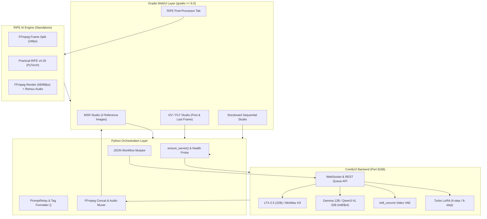

# System Patterns — AI Video Studio: LTX-2.5 & MiniMax H3

> Kiến trúc hệ thống, các mẫu thiết kế (design patterns) và quy tắc luồng dữ liệu.

## 1. Kiến trúc tổng thể (Architecture Overview)

## 2. Các mẫu thiết kế chính (Key Patterns)

### A. Cell Isolation & Modular Execution
- **Cell 1 (`download.py`):** Chỉ làm nhiệm vụ tải model, cài đặt custom nodes, giải nén và chuẩn bị tài nguyên. Tránh lẫn lộn logic chạy server.
- **Cell 2 (`minimax.py` / `ltx2_5.py`):** Khởi chạy server ComfyUI ở chế độ background subprocess, kiểm tra trạng thái qua socket health-check, sau đó mount giao diện Gradio UI.
- **Cell 3 (`rife_postprocess.py`):** Hoàn toàn độc lập (100% Standalone). Không cần ComfyUI chạy, có thể nhận video từ output của Cell 2 hoặc bất kỳ video nào do người dùng tải lên.

### B. Dynamic Workflow Injection Pattern
- Thay vì hardcode toàn bộ cấu trúc node trong mã Python, hệ thống load mẫu workflow JSON cơ sở (`workflow/`), sau đó dynamically clone và cập nhật các tham số:
  - Tên ảnh đầu vào (`inputs.image` / `inputs.image_path`).
  - Seed ngẫu nhiên hoặc cố định.
  - Số bước lấy mẫu (steps) và cfg / sigmas.
  - Câu nhắc tích cực (`positive`) và tiêu cực (`negative`).
  - Đường dẫn file xuất ra.

### C. Multi-Subject Reference Tag Mapping
- Trong MiniMax H3, ảnh tham chiếu được tải vào thư mục `/content/ComfyUI/input/` và gán nhãn đại diện:
  - `<Picture 1>` $\rightarrow$ Ảnh nhân vật chính 1
  - `<Picture 2>` $\rightarrow$ Ảnh nhân vật 2 / Đối thủ / Bạn đồng hành
  - `<Picture 3>` $\rightarrow$ Ảnh nhân vật 3 / Vật phẩm quan trọng
  - `<Picture 4>` $\rightarrow$ Ảnh bối cảnh / Môi trường
- Kịch bản prompt được chuẩn hóa để gọi chính xác tag `<Picture X>`, giúp mô hình chú ý vào đặc trưng visual tương ứng từ text encoder Qwen3-VL.

### D. Storyboard Auto-Chaining Pattern (LTX-2.5)
- **Nối cảnh mượt mà:** Trích xuất frame cuối cùng của Cảnh $N$ bằng OpenCV (`cv2.VideoCapture`), lưu tạm làm frame bắt đầu của Cảnh $N+1$.
- **Bám nhân vật định kỳ / nghiêm ngặt:** Đan xen giữa ảnh tham chiếu gốc và frame nối tiếp để vừa giữ tính liền mạch của chuyển động, vừa không bị trôi (drift) diện mạo nhân vật sau nhiều cảnh liên tiếp.
- **Nối file tự động:** Dùng FFmpeg `concat demuxer` nối liền các cảnh mà không cần re-encode làm giảm chất lượng.
