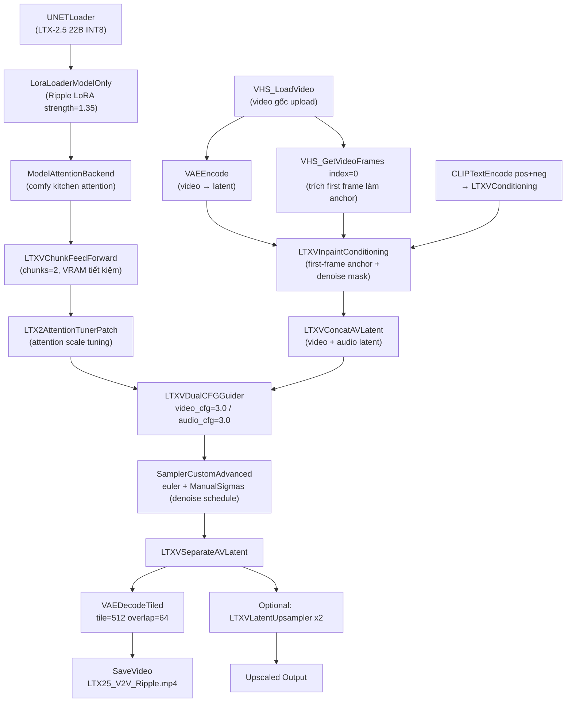

```mermaid
flowchart TD                                                                                                                                           
        A["VHS_LoadVideo\n(video gốc upload)"] --> B["VAEEncode\n(video → latent)"]                                                                        
        A --> C["VHS_GetVideoFrames index=0\n(trích first frame làm anchor)"]                                                                              
                                                                                                                                                           
        D["UNETLoader\n(LTX-2.5 22B INT8)"] --> E["LoraLoaderModelOnly\n(Ripple LoRA strength=1.35)"]                                                      
        E --> F["ModelAttentionBackend\n(comfy kitchen attention)"]                                                                                        
        F --> G["LTXVChunkFeedForward\n(chunks=2, VRAM tiết kiệm)"]                                                                                        
        G --> H["LTX2AttentionTunerPatch\n(attention scale tuning)"]                                                                                       
                                                                                                                                                           
        B --> I["LTXVInpaintConditioning\n(first-frame anchor + denoise mask)"]                                                                            
        C --> I                                                                                                                                            
                                                                                                                                                           
        J["CLIPTextEncode pos+neg\n→ LTXVConditioning"] --> I                                                                                              
                                                                                                                                                           
        I --> K["LTXVConcatAVLatent\n(video + audio latent)"]                                                                                              
        H --> L["LTXVDualCFGGuider\nvideo_cfg=3.0 / audio_cfg=3.0"]                                                                                        
        K --> L                                                                                                                                            
                                                                                                                                                           
        L --> M["SamplerCustomAdvanced\neuler + ManualSigmas (denoise schedule)"]                                                                          
        M --> N["LTXVSeparateAVLatent"]                                                                                                                    
        N --> O["VAEDecodeTiled\ntile=512 overlap=64"]                                                                                                     
        O --> P["SaveVideo\nLTX25_V2V_Ripple.mp4"]                                                                                                         
                                                                                                                                                           
        Q["Optional: LTXVLatentUpsampler x2"] --> R["Upscaled Output"]                                                                                     
        N --> Q      
```